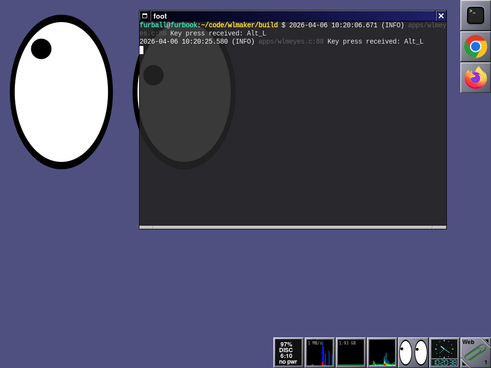

# wlmaker - Wayland Maker

A [Wayland](https://wayland.freedesktop.org/) compositor inspired by
[Window Maker](https://www.windowmaker.org/).

Key features:

* Compositor for windows in stacking mode.
* Supports multiple workspaces.
* Appearance inspired by Window Maker, following the look and feel of NeXTSTEP.
* Easy to use, lightweight, low gimmicks and fast.
* Dock and clip, to be extended for dockable apps.

How it looks: 

### Current status

Wayland Maker is in early development stage. Highlights for current version (0.3):

* *new:* Screen saver support, through `ext_session_lock_v1` and `idle_inhibit_unstable_v1` protocols.
* *new:* Configurable through plist text files: [base configuration](etc/wlmaker.plist), [style](/etc/style-default.plist) and [docks & workspaces](etc/wlmaker-state.plist).
* *new:* wlr layer shell support (`wlr_layer_shell_unstable_v1`), fully implemented & tested.
* Appearance matches Window Maker: Decorations, dock, clip.
* Support for Wayland XDG shell (mostly complete. Bug reports welcome).
* Initial support for X11 applications (positioning and specific modes are missing).
  Use `--start_xwayland` argument to enable XWayland, it's off by default.
* A prototype DockApp (`apps/wlmclock`).

For further details, see the [roadmap](doc/ROADMAP.md).

Protocol support:

* `xdg-decoration-unstable-v1`: Implemented & tested.
* `ext_session_lock_v1`: Implemented & tested.
* `wlr_layer_shell_unstable_v1`: Implemented & tested.
* `xdg_shell`: Largely implemented & tested.
* `idle_inhibit_unstable_v1`: Implemented, untested.

### Build & use it!

* From source: Please follow the [detailled build instructions](doc/BUILD.md)
  for a step-by-step guide.

* Once compiled, see the [these instructions](doc/RUN.md) on how to run
  Wayland Maker in a window or standalone, and to configure it for your needs.

> [!NOTE]
> `wlmaker` is still in early development, so it's not recommended to use it as
> your primary compositor.

## Contributing

Contributions and help are highly welcome! See
[`CONTRIBUTING.md`](CONTRIBUTING.md) for details, and
[code of conduct](CODE_OF_CONDUCT.md) for more.

## License

Apache 2.0; see [`LICENSE`](LICENSE) for details.

## Disclaimer

This project is not an official Google project. It is not supported by
Google and Google specifically disclaims all warranties as to its quality,
merchantability, or fitness for a particular purpose.
