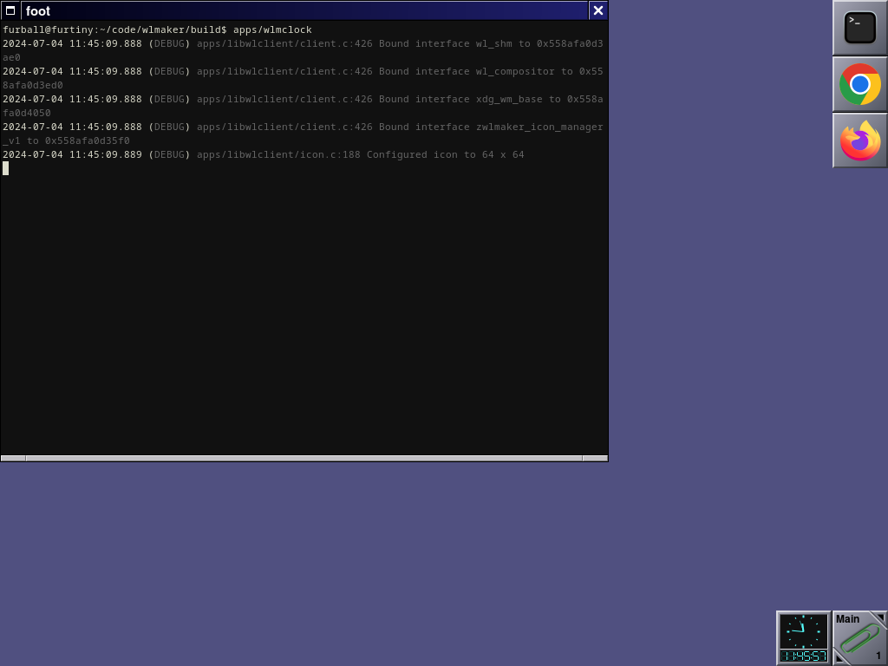

#  WaylandMaker - wlmaker

A [Wayland](https://wayland.freedesktop.org/) compositor inspired by
[Window Maker](https://www.windowmaker.org/).

Key features:

* Compositor for windows in stacking mode.
* Supports multiple workspaces.
* Appearance inspired by Window Maker, following the look and feel of NeXTSTEP.
* Easy to use, lightweight, low gimmicks and fast.
* Dock and clip, to be extended for dockable apps.

How it looks, running in a window using the default theme:

### Current status

**Early access**: Wayland Maker covers elementary compositor functionality on single-monitor output. Please report what's missing or broken!

See [here](doc/FEATURES.md) for a detailed list of implemented or planned
features, or the [roadmap](doc/ROADMAP.md) for what's planned for the upcoming
versions.

Highlights for current version ([0.7.1](https://github.com/phkaeser/wlmaker/releases/tag/v0.7.1)):

* *new* Support for copy-paste and middle-click paste.
* *new* Read keyboard configuration from `/etc/default/keyboard`.
* *new* DockApps for monitoring CPU, Memory and Network.
* *new* `wlmtool`, eliminating the need for depending on `wmmenugen`.
* *new* Various bug fixes ([#438](https://github.com/phkaeser/wlmaker/issues/438), [#439](https://github.com/phkaeser/wlmaker/issues/439), [#444](https://github.com/phkaeser/wlmaker/issues/444)).
* *new* Builds with [wlroots 0.18, 0.19 and 0.20](https://gitlab.freedesktop.org/wlroots/wlroots/-/tags).
* Support for multiple outputs, configuable through `wlr-output-management-unstable-v1` protocol (eg. `wlr-randr`, `wdisplays`).
* [Root menu](https://phkaeser.github.io/wlmaker/root_menu.html) can be generated from XDG repository ([#90](https://github.com/phkaeser/wlmaker/issues/90), eg. `wmmenugen`), and can be navigated by keyboard.
* Screen saver support, through `ext-session-lock-v1` and `idle-inhibit-unstable-v1` protocols.
* Hot corners with configurable actions, default to 'lock' or 'inhibit' locking.
* Configurable through plist text files: [base configuration](etc/wlmaker.plist),
  [style](etc/style.plist), [root menu](etc/root-menu.plist) and
  [docks & workspaces](etc/wlmaker-state.plist).
* wlr layer shell support (`wlr-layer-shell-unstable-v1`), fully implemented & tested.
* Appearance matches Window Maker: Decorations, dock, clip.
* Support for Wayland XDG shell (mostly complete. Bug reports welcome).
* Initial support for X11 applications (positioning and specific modes are missing).
  Use `--start_xwayland` argument to enable XWayland, it's off by default.
* Prototype DockApps (`apps/wlmclock`, `apps/wlmeyes`).

### All the details?

See http://phkaeser.github.io/wlmaker for:

* How to configure wlmaker.
* Startup options.
* Supported Wayland protocols.

### Build & use it!

* From source: Please follow the [detailed build instructions](doc/BUILD.md)
  for a step-by-step guide.

* Once compiled, see the [these instructions](doc/RUN.md) on how to run
  Wayland Maker in a window or standalone, and to configure it for your needs.

* Alternatively, use a pre-built package:

  

## Contributing

Contributions, help and bug reports are highly welcome! See
[`CONTRIBUTING.md`](CONTRIBUTING.md) for details, and
[code of conduct](CODE_OF_CONDUCT.md) for more.

## License

Apache 2.0; see [`LICENSE`](LICENSE) for details.

## Disclaimer

This project is not an official Google project. It is not supported by
Google and Google specifically disclaims all warranties as to its quality,
merchantability, or fitness for a particular purpose.

[#147](https://github.com/phkaeser/wlmaker/issues/147): Why is every file
copyrighted by Google, then? Google happens to be the primary author's
employer, and the copyright note is default recommended Open Source procedure.
